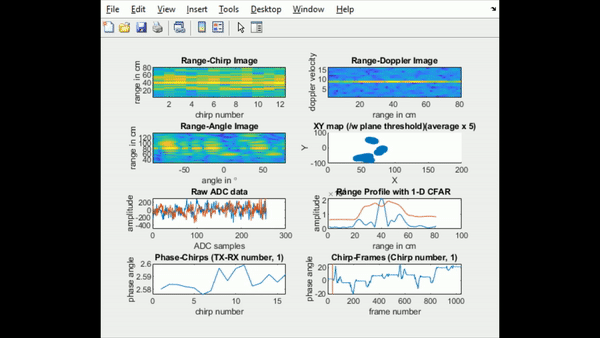

# FMCW radar features (Matlab)
FMCW Radar features visualization (MATLAB version)

This matlab repo is used for visualizing the FMCW radar features in real time. A Data was collected from IWR1443 Dev board thorugh mm-wave studion software.

# Programming details.
1. main.m
2. read_file.m (read .bin file (this source code was coppied from Mmwave Radar Device ADC Raw Data Capture (Rev. B))
3. feature_extract.m (perform 3D FFT to get a range-profile, doppler-profile, and angle-profile)
4. cfar_detection_1D.m (perform 1D cfar on range-profile to get an object's location)
5. visualization.m (plot all features)

# Our setup.

"link to download data (test_range_3tx.bin)", [Link](https://drive.google.com/file/d/14t9Gj5UK9gnhOGA3Ep9-ggn1aVUkzCPw/view?usp=share_link)

# Visualization components.
1. Range-Chirp profile
2. Range-Doppler profile
3. Range-Angle profile
4. XY detection (using plane threshold)
5. Raw ADC plot
6. Range Profile and CFAR 
7. Phase-Chirp profile
8. Chirp-Frame profile

